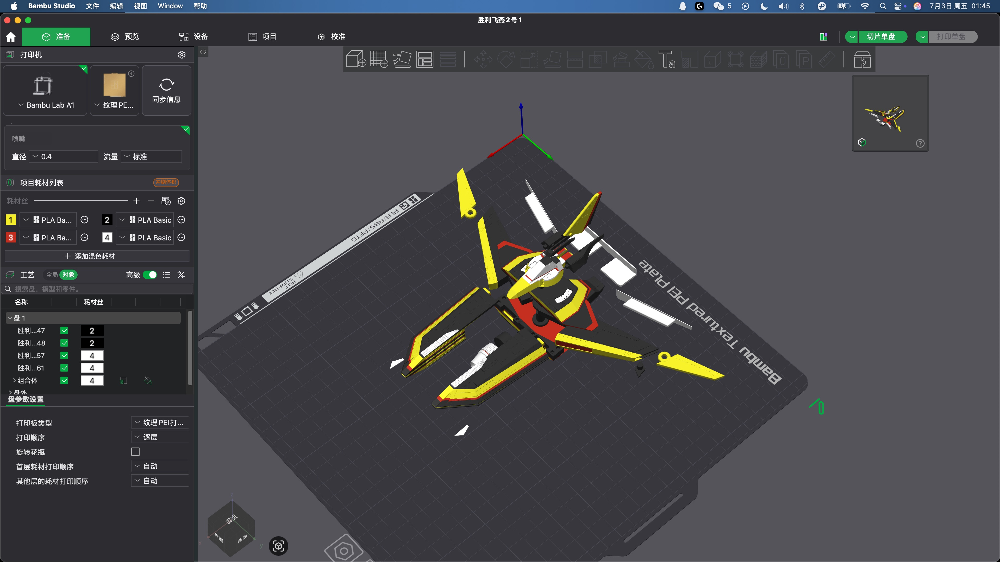
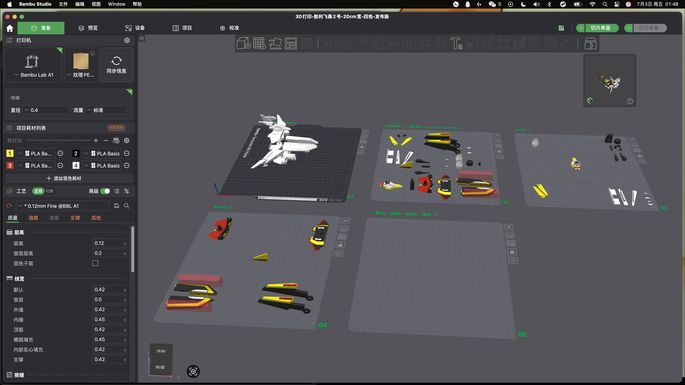

# Victory Swallow 2 Color-Separated 3D Printable Fan Model

胜利飞燕2号 四色分件 3D 打印模型



This repository contains an unofficial fan-made, color-separated 3D printable model inspired by Victory Swallow 2. The release is prepared as a print-ready Bambu Studio 3MF project with a target width of about 20 cm.

这是一个非官方粉丝制作的胜利飞燕2号 3D 打印模型，已做四色分件和 Bambu Studio 打印排版，目标成品宽度约 20 cm。

## Download

The main printable file is:

- [`models/victory-swallow-2_20cm_4color_v1.0.0.3mf`](models/victory-swallow-2_20cm_4color_v1.0.0.3mf)

Open the 3MF file in Bambu Studio, review the plates and filament mapping, then slice or print with your own machine settings.

## Preview



## Print Profile

The included 3MF was prepared with these settings:

| Item | Setting |
| --- | --- |
| Slicer | Bambu Studio 02.07.01.62 |
| Printer profile | Bambu Lab A1 |
| Plate | Textured PEI Plate |
| Nozzle | 0.4 mm |
| Layer height | 0.12 mm |
| First layer height | 0.2 mm |
| Filament | PLA |
| Colors | Yellow `#F4EE2A`, black `#000000`, red `#C12E1F`, white `#FFFFFF` |
| Infill | 20% |
| Supports | Tree auto |
| Walls | 2 |
| Top/bottom shell layers | 5 / 5 |

More notes are in [`docs/print-guide.md`](docs/print-guide.md) and [`docs/assembly-guide.md`](docs/assembly-guide.md).

## Repository Contents

```text
models/
  victory-swallow-2_20cm_4color_v1.0.0.3mf
images/
  preview-assembled.jpeg
  preview-plates.jpeg
docs/
  print-guide.md
  assembly-guide.md
```

## License

Except where otherwise noted, my original modeling work, color separation, print layout, documentation, and preview images in this repository are licensed under the Creative Commons Attribution 4.0 International License.

除非另有说明，本仓库中由我原创制作的建模、分件、打印排版、文档和预览图以 Creative Commons Attribution 4.0 International License 授权发布。

- License: CC BY 4.0
- License text: [`LICENSE`](LICENSE)
- License URL: <https://creativecommons.org/licenses/by/4.0/>
- SPDX identifier: `CC-BY-4.0`

Suggested attribution:

```text
"Victory Swallow 2 Color-Separated 3D Printable Fan Model" by Wenshuishi0528,
licensed under CC BY 4.0, available at https://github.com/Wenshuishi0528/victory-swallow-2-3d-print
```

See [`ATTRIBUTION.md`](ATTRIBUTION.md) for details.

## Fan Work Notice

This is an unofficial fan work. It is not affiliated with, sponsored by, endorsed by, or approved by any original rights holder. Names, trademarks, and original fictional designs belong to their respective owners and are used only for identification.

本项目是非官方粉丝作品，与任何原权利方无从属、赞助、背书或官方授权关系。相关名称、商标和原始虚构设计归各自权利人所有，此处仅用于识别说明。

The CC BY 4.0 license only applies to the contributor's original work in this repository. It does not grant any rights to third-party intellectual property, trademarks, characters, settings, or original fictional designs.

CC BY 4.0 只适用于本仓库贡献者自己的原创劳动成果，不授予任何第三方 IP、商标、角色、设定或原始虚构设计的权利。

## Disclaimer

3D printing always involves machine, filament, slicer, and assembly variation. Review the model, orientation, supports, and filament mapping before printing. Use at your own risk.
